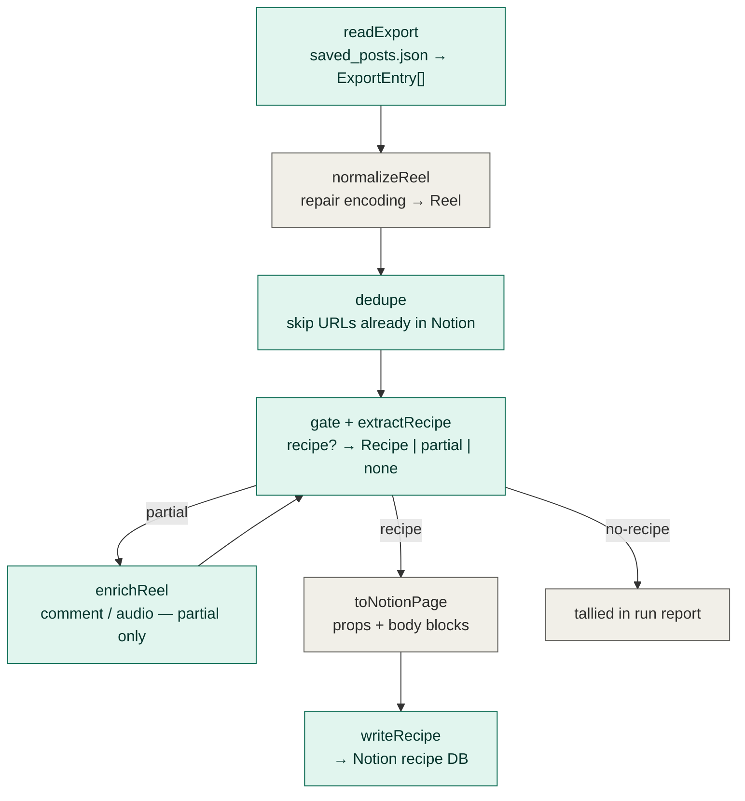

# Instagram Saved Reels → Notion Recipe Extractor

**Architecture & Requirements**
Status: draft · Owner: Nick · Target runtime: Hermes Agent (Nous Portal)

---

## 1. Overview

Autonomously mine the user's Instagram *Saved* reels archive, extract any recipe found in each reel's text, and persist it as a structured page in a Notion recipe database. Built as a functional, ports-and-adapters pipeline so the three external couplings — the saved-reels source, the extraction model, and the Notion sink — are each independently swappable.

One pass: read export → normalize → dedupe → gate → extract → map → write, with a run report at the end.

The system is a sibling of the X Bookmarks → Notion organizer and shares its spine (functional core, `Result` everywhere, ports at the edges, Hermes-delegated concurrency). It diverges in two places that this doc treats as first-class concerns rather than afterthoughts: **the source is a local file, not an API** (§7), and **not every saved reel is a recipe** (§8).

---

## 2. Scope & scale

- **Source: the official "Download Your Information" export.** A local `saved_posts.json`, JSON format, all-time range. No live API, no scraping in the common path.
- **Design target: low hundreds to ~1,000 saved reels.** Must handle that range with config changes only (pool sizes), not code changes.
- **Re-runnable / idempotent.** Subsequent runs add only new reels; existing pages are never duplicated or mutated.
- Single user, single Instagram account, single Notion database.

The binding constraint has *moved* relative to the bookmarks project. Because the caption ships inside the export, retrieval is offline and free — there is no per-item network fetch and no source rate limit in the common path. The two remaining cost/throughput limits are (a) the extraction model calls and (b) Notion's write ceiling (~3 req/s). Those two, not retrieval, set the concurrency knobs in §10.

---

## 3. Functional requirements

| ID | Requirement |
|----|-------------|
| FR1 | Read and parse `saved_posts.json` into raw export entries, tolerant of empty `media` arrays and missing labels. |
| FR2 | Normalize each entry into a source-agnostic `Reel`: **repair the mojibake caption encoding**, then extract URL, caption, hashtags, creator (display name + handle), and saved-at date. |
| FR3 | Gate each reel: classify whether it contains a recipe. Non-recipes are tallied and skipped, never written. |
| FR4 | Extract a structured `Recipe` from available text: name, summary, cuisine, meal type, effort, ingredients (quantity/unit/item), steps, prep/cook time, servings, optional nutrition passthrough. |
| FR5 | Escalate to enrichment (first comment, then audio transcript / on-screen OCR) **only** for reels gated as recipe-but-incomplete. |
| FR6 | Dedupe against the Notion database by source URL; only previously-unseen reels proceed to write. |
| FR7 | Write one Notion page per recipe: scalar fields as properties, ingredients + steps as page-**body** blocks. |
| FR8 | Emit a run report: total found, recipes written, skipped-as-duplicate, no-recipe, partial/escalated, failed; plus a per-cuisine and per-meal-type tally. |

---

## 4. Non-functional requirements

| ID | Requirement | Why it matters here |
|----|-------------|---------------------|
| NFR1 | **Idempotency** — no duplicate pages across runs. | Re-runs after adding new saves are the expected usage; dedup by URL is the safety net. |
| NFR2 | **Encoding correctness** — mojibake repair is mandatory and unit-tested. | The raw caption is double-encoded (§7.2). Skip the repair and every emoji, bullet, and en-dash feeds the model as garbage, poisoning extraction. |
| NFR3 | **Bounded, tier-weighted concurrency** — respect Notion's write ceiling and cap multimodal work separately. | Notion trips at ~3 req/s. Tier-2 (audio/OCR) reels are far heavier than tier-0 and need a narrower pool. |
| NFR4 | **Resumability** — a partial run re-runs safely. | Dedup means already-written recipes are skipped automatically on the next pass. |
| NFR5 | **Cost-bounded** — tier-0 extraction runs on a cheap model; escalation is rare. | Most recipes resolve from the caption alone. A full run should cost well under $1 (§11). |
| NFR6 | **Fault isolation** — one malformed entry never fails the batch. | A single missing label or model timeout shouldn't sink the other 499. Stages return failures, never throw across boundaries. |
| NFR7 | **Observability** — per-reel outcome and tier are surfaced, not swallowed. | The run report and a `Source` property on each page record which tier produced each extraction, so low-trust rows are auditable. |

---

## 5. Architecture

Ports-and-adapters with a functional core. Pure transforms (`normalizeReel`, `toNotionPage`) sit in the middle with zero I/O — trivially unit-testable with plain objects, no mocks. All real-world coupling is isolated in the effectful **ports** at the edges, each defined as a function signature so the implementation swaps without touching the core.



### The swap points (ports)

- **`ReadExport`** — reads and parses the local `saved_posts.json` today (§7). A browser-session scrape adapter satisfies the same signature if you ever want to skip the manual export.
- **`ExtractRecipe`** — the model boundary. Any text or multimodal model hides behind `(Reel) => Promise<Result<Extraction>>`. The gate lives here, returned as a discriminated union (§8).
- **`EnrichReel`** — the escalation port. Pulls the first/pinned comment or transcribes audio / OCRs frames, returning a richer `Reel`. Only invoked on the `partial` arm.
- **`WriteRecipe`** (+ `ExistingSourceUrls`) — the Notion sink. Because recipes need block-level page bodies (§9), this likely targets the Notion SDK rather than the `ntn` CLI.

---

## 6. Domain model (TypeScript)

Closed unions for every fixed-vocabulary field, `readonly` throughout, errors returned not thrown.

```typescript
// ---------- Closed vocabularies (the extractor cannot drift) ----------
type MealType =
  | "Breakfast" | "Lunch" | "Dinner"
  | "Snack" | "Dessert" | "Drink"
  | "Side" | "Sauce/Condiment";

type Cuisine =
  | "Mexican" | "Korean" | "Japanese" | "Chinese"
  | "Middle Eastern" | "Italian" | "American"
  | "Indian" | "Thai" | "Other";

type Effort = "Quick" | "Weeknight" | "Project";

// Provenance: which tier of work produced the extraction (auditable trust signal)
type ExtractionTier = "caption" | "caption+comment" | "multimodal";

// ---------- Source-shaped, untrusted (mirrors saved_posts.json, see §7) ----------
type ExportEntry = {
  readonly timestamp: number;                  // unix seconds, when saved
  readonly media: readonly unknown[];          // empty for reels — ignored
  readonly label_values: readonly LabelValue[];
  readonly fbid?: string;
};

type LabelValue =
  | { readonly label: string; readonly value: string; readonly href?: string }  // scalar
  | { readonly title: string; readonly dict: readonly DictGroup[] };            // grouped
type DictGroup = { readonly title: string; readonly dict: readonly { readonly label: string; readonly value: string }[] };

// ---------- Normalized domain entity — the rest of the pipeline only sees this ----------
type Reel = {
  readonly url: string;
  readonly creator: string;          // display name, e.g. "Natalia Gutierrez"
  readonly handle: string;           // username, e.g. "nataaliajoy"
  readonly savedAt: Date;
  readonly caption: string;          // ALREADY mojibake-repaired
  readonly hashtags: readonly string[];
  readonly availableTier: ExtractionTier;
  readonly firstComment?: string;    // populated by enrichReel
  readonly transcript?: string;      // populated by enrichReel
  readonly onScreenText?: string;    // populated by enrichReel
};

// ---------- The recipe itself ----------
type Ingredient = {
  readonly quantity?: number;        // structured → scalable later
  readonly unit?: string;
  readonly item: string;
  readonly notes?: string;
};

type Nutrition = {                   // optional passthrough only — captured if the caption states it
  readonly calories?: number;
  readonly proteinG?: number;
  readonly fatG?: number;
  readonly carbsG?: number;
};

type Recipe = {
  readonly name: string;
  readonly summary: string;          // 1–2 sentences
  readonly cuisine: Cuisine;
  readonly mealType: MealType;
  readonly effort: Effort;
  readonly ingredients: readonly Ingredient[];
  readonly steps: readonly string[];
  readonly prepMinutes?: number;
  readonly cookMinutes?: number;
  readonly servings?: number;
  readonly nutrition?: Nutrition;
  readonly sourceTier: ExtractionTier;
  readonly confidence: number;       // 0–1, model self-rated completeness
};

// ---------- The gate: not every saved reel is a recipe ----------
type Extraction =
  | { readonly kind: "recipe";    readonly recipe: Recipe }
  | { readonly kind: "partial";   readonly recipe: Recipe; readonly missing: readonly string[] }
  | { readonly kind: "no-recipe"; readonly reason: string };

// ---------- Notion sink (mirrors the EXISTING Recipes DB — see §9) ----------
// Property names, types, and select vocabularies are dictated by Nick's DB,
// not invented here. Note the type coercions: Servings/Total Time are TEXT
// in the DB; Cuisine Type/Tags/Keywords are multi-selects.
type NotionRecipePage = {
  readonly databaseId: string;
  readonly properties: {
    readonly Name: string;                       // title
    readonly Tags: readonly string[];            // multi-select ← effort + mealType, flattened
    readonly URL: string;                        // url ← reel permalink
    readonly "Cuisine Type": readonly string[];  // multi-select ← cuisine(s)
    readonly "Cook Time": number | null;         // number
    readonly "Prep Time": number | null;         // number
    readonly Servings: string;                   // TEXT ← String(servings)
    readonly "Total Time": string;               // TEXT ← String(prep + cook)
    readonly Category?: string;                  // select — vocab TBD (§9 open)
    readonly Description: string;                // text ← summary
    readonly Notes: string;                      // text ← provenance line (tier · confidence)
    readonly Keywords: readonly string[];        // multi-select ← hashtags
  };
  readonly body: {
    readonly ingredients: readonly Ingredient[]; // → to-do blocks
    readonly steps: readonly string[];           // → numbered-list blocks
    readonly nutrition?: Nutrition;              // → callout block (no property home)
  };
};

// ---------- Functional error handling ----------
type Result<T, E = Error> =
  | { readonly ok: true;  readonly value: T }
  | { readonly ok: false; readonly error: E };

// ---------- Ports (effectful, swappable) ----------
type ReadExport         = (path: string) => Promise<Result<readonly ExportEntry[]>>;
type ExistingSourceUrls = () => Promise<ReadonlySet<string>>;
type ExtractRecipe      = (reel: Reel) => Promise<Result<Extraction>>;
type EnrichReel         = (reel: Reel, toTier: ExtractionTier) => Promise<Result<Reel>>;
type WriteRecipe        = (page: NotionRecipePage) => Promise<Result<string>>;

// ---------- Pure transforms (no I/O) ----------
type NormalizeReel = (entry: ExportEntry) => Reel;
type ToNotionPage  = (databaseId: string, vocab: NotionVocab) => (reel: Reel, r: Recipe) => NotionRecipePage;
```

---

## 7. The source adapter — confirmed schema

This is the section the export shape locked down. `saved_posts.json` is a top-level array; each element is one saved reel.

### 7.1 Shape

```jsonc
{
  "timestamp": 1779341398,            // unix seconds — when YOU saved it
  "media": [],                        // empty for reels
  "label_values": [
    { "label": "URL",     "value": "https://www.instagram.com/reel/…/", "href": "…" },
    { "label": "Caption", "value": "Spicy shrimp & creamy cucumber salad …" },  // mojibake
    { "label": "Title",   "value": "" },
    { "title": "Hashtags", "dict": [ { "title": "", "dict": [ { "label": "Name", "value": "cucumbersalad" } ] }, … ] },
    { "title": "Owner",    "dict": [ { "title": "", "dict": [
        { "label": "URL",      "value": "http://linktr.ee/…" },
        { "label": "Name",     "value": "Natalia Gutierrez" },
        { "label": "Username", "value": "nataaliajoy" } ] } ] }
  ],
  "fbid": "…"
}
```

`label_values` mixes two element shapes: scalar (`{label, value, href?}`) for URL / Caption / Title, and grouped (`{title, dict[]}`) for Hashtags / Owner. The parser keys off `label` and `title` strings, so it survives reordering and tolerates absent fields.

### 7.2 The mojibake repair (the load-bearing normalization)

The caption is stored as UTF-8 bytes that were decoded as latin-1 and then JSON-escaped. Example: the shrimp emoji 🦐 (`U+1F990`, UTF-8 bytes `F0 9F A6 90`) appears as `\u00f0\u009f\u00a6\u0090`. Bullets (`•` → `\u00e2\u0080\u00a2`) and en-dashes (`–` → `\u00e2\u0080\u0093`) are mangled the same way. The fix is a latin-1 → UTF-8 round-trip, applied to every text field before it reaches the model:

```typescript
// Node runtime
const repairMojibake = (s: string): string =>
  Buffer.from(s, "latin1").toString("utf8");

// Browser / non-Node runtime
const repairMojibakeWeb = (s: string): string =>
  new TextDecoder("utf-8").decode(Uint8Array.from(s, (c) => c.charCodeAt(0)));
```

This belongs in `normalizeReel`, is pure, and gets a unit test with the shrimp-emoji fixture so a future export-format change is caught immediately.

### 7.3 The parser (pure core of `normalizeReel`)

```typescript
const scalar = (lvs: readonly LabelValue[], label: string): string | undefined =>
  lvs.find((lv): lv is Extract<LabelValue, { label: string }> => "label" in lv && lv.label === label)?.value;

const group = (lvs: readonly LabelValue[], title: string): readonly DictGroup[] =>
  (lvs.find((lv): lv is Extract<LabelValue, { title: string }> => "title" in lv && lv.title === title)?.dict) ?? [];

const normalizeReel: NormalizeReel = (entry) => {
  const lvs = entry.label_values;

  const url = scalar(lvs, "URL") ?? "";
  const caption = repairMojibake(scalar(lvs, "Caption") ?? "");

  const hashtags = group(lvs, "Hashtags")
    .flatMap((g) => g.dict)
    .filter((d) => d.label === "Name")
    .map((d) => d.value);

  const owner = group(lvs, "Owner")[0]?.dict ?? [];
  const find = (label: string) => owner.find((d) => d.label === label)?.value ?? "";

  return {
    url,
    creator: repairMojibake(find("Name")),
    handle: find("Username"),
    savedAt: new Date(entry.timestamp * 1000),
    caption,
    hashtags,
    availableTier: "caption",   // caption ships in the export → tier-0 is offline
  };
};
```

`ReadExport` is the thin effectful wrapper: read the file, `JSON.parse`, validate it's an array, return `Result<ExportEntry[]>`. Everything downstream is pure until the model call.

---

## 8. The gate & escalation ladder

A bookmark *is* its text; a recipe reel often isn't. The recipe might be fully in the caption (your sample is — ingredients and a Title line present), in a pinned first comment, burned into on-screen text, or only spoken in the audio. So `extractRecipe` is a gate plus a ladder, not a single call.

**Tiers** (the `toTier` argument to `enrichReel`):

| Tier | Input | Cost | When |
|------|-------|------|------|
| `caption` | export caption + hashtags | offline retrieval; cheap model | always first |
| `caption+comment` | + first/pinned comment | one fetch | gate says recipe, caption incomplete |
| `multimodal` | + audio transcript and/or frame OCR | video fetch + transcription | gate says recipe, still incomplete |

**Cheap pre-gate.** Before any model call, a pure heuristic reads the hashtags and caption for recipe signals (an `Ingredients`/`Recipe` header, measurement tokens, food hashtags). Strong signal → straight to extract; weak/none → a cheap classifier confirms recipe-vs-not, so non-recipe reels never pay for a full extraction.

**Escalate only on `partial`.** The `Extraction` union is the control flow: `recipe` proceeds to map/write, `no-recipe` is tallied and dropped, `partial` triggers one `enrichReel` step up the ladder and a re-extract. Cap escalation at one or two climbs so a stubborn reel can't loop.

---

## 9. Notion schema

This maps onto the **existing** Recipes DB. The schema below is the source of truth; the domain model bends to it, not the reverse. Property names and select vocabularies are not hardcoded — `notion.databases.retrieve` reads them at startup so the extractor can never emit a value the DB won't accept (§9.3). Block children (ingredients/steps) aren't a property write, so the sink uses the Notion SDK rather than `ntn`.

### 9.1 Property mapping

| Recipes DB property | DB type | Source | Coercion |
|---|---|---|---|
| Name | title | `name` | — |
| Tags | multi-select | `effort` + `mealType` | flattened into one multi-select; values constrained to existing Tag options |
| URL | url | reel permalink | always set on pipeline rows (§9.4) |
| Cuisine Type | multi-select | `cuisine` | wrapped to array; values constrained to existing options |
| Cook Time | number | `cookMinutes` | — |
| Prep Time | number | `prepMinutes` | — |
| Servings | **text** | `servings` | `String(servings)` — column is text, not number |
| Total Time | **text** | `prepMinutes + cookMinutes` | `String(total)` — column is text, not number |
| Category | select | — | vocab unknown — left unset until options confirmed (§14) |
| Description | text | `summary` | — |
| Notes | text | provenance | `"caption · conf 0.82"` — gives `sourceTier`/`confidence` a home with no schema change |
| Keywords | multi-select | `hashtags` | the reel hashtags from the export |

Effort, MealType, and the provenance fields have no dedicated columns, so they fold into Tags and Notes respectively — the mapping layer absorbs the impedance mismatch and the domain model stays expressive. Nutrition (if the caption states it) has no property home; it becomes a callout block in the body or is dropped — passthrough only, never aggregated.

### 9.2 Page body blocks (matches your existing records)

- Ingredients → a to-do list (check items off while shopping/cooking). Structured `quantity`/`unit`/`item` render as `"2 tbsp mayonnaise"` but stay scalable.
- Steps → a numbered list.

### 9.3 Vocabulary is introspected, not invented

At startup the writer calls `databases.retrieve` and reads the `multi_select`/`select` options for Tags, Cuisine Type, Keywords, and Category. Two policies:

- **Strict (default):** the model is handed your existing options and must pick from them; an unrecognized cuisine maps to the nearest or is omitted. No drift.
- **Permissive:** the model may propose new options, created via the API. The DB grows organically but you risk `Thai` vs `thai food` duplicates.

Default strict, with proposed-new values written to the run report as a review queue rather than created silently.

### 9.4 Dedupe with sometimes-missing URLs

Primary key is the **reel ID parsed out of the URL** (`/reel/{id}/`), compared against the URL column — robust to query-string and trailing-slash differences. Every pipeline-written row has a URL, so re-runs dedupe cleanly. Your hand-entered recipes without a URL never match a reel, which is correct. The one gap — a manually-added recipe that is secretly the same dish as a saved reel — is caught by a *soft* secondary check (fuzzy Name match) that flags a possible duplicate to the review queue; it never auto-skips, so a real new recipe is never silently dropped.

### 9.5 The writer (impedance absorbed here)

```typescript
const toNotionPage =
  (databaseId: string, vocab: NotionVocab) =>
  (reel: Reel, r: Recipe): NotionRecipePage => {
    const total = (r.prepMinutes ?? 0) + (r.cookMinutes ?? 0);
    return {
      databaseId,
      properties: {
        Name: r.name,
        Tags: constrain([r.effort, r.mealType], vocab.tags),       // strict mode
        URL: reel.url,
        "Cuisine Type": constrain([r.cuisine], vocab.cuisineType),
        "Cook Time": r.cookMinutes ?? null,
        "Prep Time": r.prepMinutes ?? null,
        Servings: r.servings != null ? String(r.servings) : "",     // text column
        "Total Time": total > 0 ? String(total) : "",               // text column
        Description: r.summary,
        Notes: `${r.sourceTier} · conf ${r.confidence.toFixed(2)}`,
        Keywords: constrain(reel.hashtags, vocab.keywords),
      },
      body: { ingredients: r.ingredients, steps: r.steps, nutrition: r.nutrition },
    };
  };
```

`constrain` is the strict-mode filter: keep only values present in the introspected vocab, route the rest to the review queue. The writer takes the `(reel, recipe)` pair — URL, hashtags, and saved date come from the reel; everything else from the extracted recipe. It stays pure: `vocab` is read once by an effectful call and passed in.

---

## 10. Concurrency & Hermes integration

Runs as a Hermes agent task, later packaged as a `SKILL.md` slash command. The pipeline's parallelism *is* the agent's delegation width — but unlike the bookmarks project's single dial, there are two pools because the tiers have wildly different weights:

- **Tier-0 pool** (caption extract + Notion write): bounded by Notion's ~3 req/s. A `p-limit` of ~3–4 keeps writes under the ceiling; this maps to `delegation.max_concurrent_children`.
- **Tier-2 pool** (multimodal enrichment): a *separate*, narrower `p-limit` (1–2). Audio transcription and OCR are slow and expensive; running them at the tier-0 width wastes money and stalls the write path.

Retrieval is no longer a pool at all — the export is one local file read. That's the simplification the in-export caption bought.

---

## 11. Cost model

Dominated by model calls, since retrieval is free. Tier-0 is a small caption (a few hundred tokens) on a cheap model — at ~1,000 reels this stays well under $1. Escalation cost scales only with the *partial* subset: if 10–15% of recipe reels need a comment fetch and a few percent need transcription, the multimodal spend is bounded and visible in the run report. The `Confidence` and `Source` fields let you spot-audit whether cheap-tier extractions are good enough before paying to escalate more aggressively.

---

## 12. Run report & observability

Emitted at the end of every run:

- Totals: found, recipes written, skipped-as-duplicate, no-recipe, partial/escalated, failed.
- Tallies: per-cuisine, per-meal-type, per-tier.
- Failures: per-reel URL + stage + error, so a re-run can target them.

Per-page provenance (`Source`, `Confidence`) makes low-trust rows queryable inside Notion itself.

---

## 13. Module layout

```
saved/
  ports.ts        // port signatures + Result type
  result.ts       // ok()/err()/map/flatMap helpers
  transforms.ts   // repairMojibake, normalizeReel  (pure, fully tested)
  classify.ts     // domain router + cheap heuristic pre-pass
  registry.ts     // Domain → DomainExtractor lookup
  enrich.ts       // EnrichReel adapters (comment, transcript, OCR) — shared
  notion.ts       // schema introspection + SDK writer + seen-ledger
  pipeline.ts     // read → normalize → dedupe → classify → dispatch → write
  config.ts       // pool sizes, model ids, db ids, escalation cap
  run.ts          // CLI / Hermes entrypoint (--census | full), prints the report
  SKILL.md        // (later) wraps run.ts as a Hermes slash command
  domains/
    recipe.ts     // DomainExtractor<Recipe>: gate + extract + toNotionPage (§9) — FIRST
    // travel.ts, fitness.ts … same interface, added later
```

The pure core (`transforms.ts`, the `classify.ts` heuristic, `domains/recipe.ts` parsing) carries the highest bug risk and is the part testable fastest, with plain fixtures and no mocks. Start there.

---

## 14. Open questions / next steps

1. **`Category` select options.** The one column whose vocabulary the screenshots didn't show (collapsed, empty in the sample). Send its options and the writer populates it; until then it's left unset.
2. **Comment & audio access for `enrichReel`.** The export has no comments or audio, so escalation needs a fetch path (oEmbed, a logged-in scrape, or `yt-dlp` + Whisper for audio). Decide how far up the ladder is worth building — caption-only may cover most of your saves.
3. **Tags semantics.** Tags currently absorbs both effort and meal type. If you'd rather keep those as separate columns, that's a one-column add to the DB and a two-line change to the §9.1 mapping.
4. **Build order.** `transforms.ts` (parser + mojibake repair) → `notion.ts` (introspect + writer) → `domains/recipe.ts` (gate + extract) → wire `pipeline.ts` → wrap as `SKILL.md`.

---

## 15. Extensibility — one archive, many extractors

The recipe pipeline is the first tenant of a more general design: the saved archive is a stream of intent, and recipes are one seam. Everything above the classifier — read, mojibake-repair, normalize, dedupe — is shared infrastructure; everything below is a per-domain plugin with its own schema and its own Notion target. The recipe extractor targets your existing Recipes DB; a future travel or fitness extractor targets its own.

The single change that unlocks it: the binary recipe gate generalizes to a **classifier** that labels each reel by domain, and `extractRecipe` becomes the first registered `DomainExtractor`.

```typescript
type Domain = "recipe" | "travel" | "fitness" | "gear" | "reading" | "other";
type Classify = (reel: Reel) => Promise<Result<{ domain: Domain; confidence: number }>>;

type DomainExtractor<T> = {
  readonly domain: Domain;
  readonly extract: (reel: Reel) => Promise<Result<Extraction<T>>>;
  readonly toNotionPage: (item: T) => NotionPage;  // maps to THIS domain's DB
  readonly databaseId: string;
};
```

Adding a domain later is implementing this interface and registering it; the pipeline dispatches on the label and tallies anything `other`.

**Census mode.** Before building any new extractor, run the pipeline as read → normalize → classify → stop, tallying by domain. One small classification call per reel (or a free heuristic pass over the export hashtags) reports the distribution — "≈340 recipes, 120 travel, 80 workouts, 40 gear" — so you invest only where the volume justifies it. Census and a full run are the same pipeline; a flag bails at the classifier.

**One seen-ledger.** With multiple target DBs, idempotency lives in a single processed-URL ledger checked right after normalize, before the classify call — so an already-handled reel never pays for classification or extraction again, across every domain.