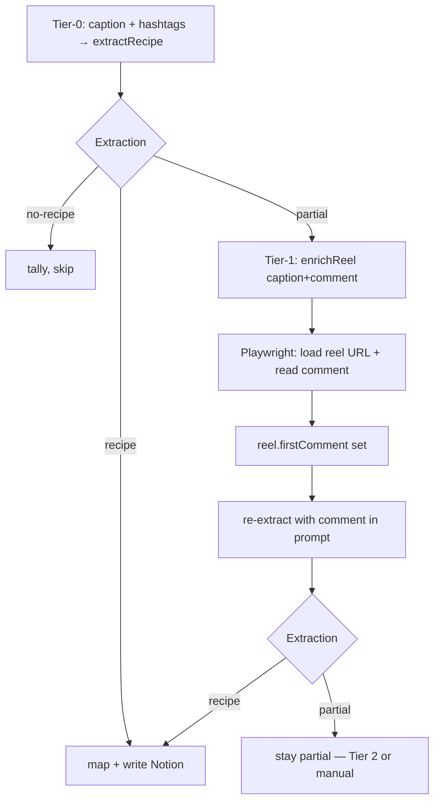
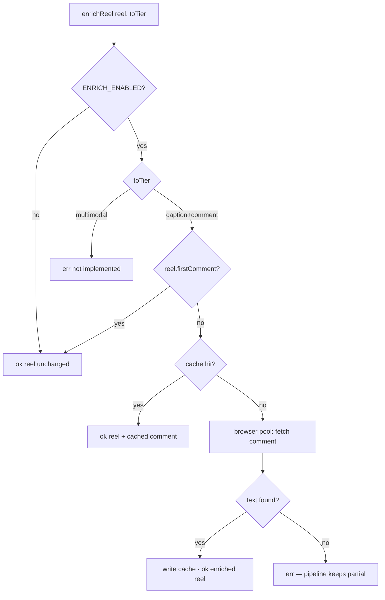

# Tier 1 enrichment: Playwright + Instagram cookies

**Status:** spec (not implemented)  
**Relates to:** [architecture.md §8 — Gate & escalation ladder](../architecture.md#8-the-gate--escalation-ladder)  
**Port:** `EnrichReel` in `src/ports.ts` · stub in `src/enrich.ts`

---

## Overview

Tier 1 is **`caption+comment`**: after Tier‑0 extraction returns **`partial`**, fetch the reel’s **first or pinned comment** from Instagram, attach it to the `Reel`, and **re-extract** with Gemini. The export JSON has no comments; this step requires a logged-in browser session.

Tier 2 (`multimodal` — audio transcript / on-screen OCR) is out of scope for this document.



The pipeline already calls `enrichReel(reel, "caption+comment")` on `partial`; today `src/enrich.ts` is a no-op, so partials never gain context.

---

## 1. Authentication: Netscape cookies vs Playwright storage state

Playwright does **not** load Netscape `cookies.txt` directly. Runtime auth uses **Playwright `storageState` JSON** (a list of cookies, optionally `origins` for localStorage).

| Format | Description | Role in Miso |
|--------|-------------|--------------|
| **Netscape `cookies.txt`** | Tab-separated export from a browser extension or tool | **Input only** — convert once via CLI |
| **`ig-storage.json`** | Playwright `{ cookies: Cookie[] }` | **Runtime** — `browser.newContext({ storageState })` |
| **Manual login** | `context.storageState({ path })` after interactive login | Fallback when Netscape export is incomplete |

**Cookies are sufficient** for reading comments on saved reels. You typically do **not** need `origins` / localStorage unless the site behaves differently without it.

**Required cookies (indicative):** `sessionid`, `csrftoken`, `ds_user_id` on `.instagram.com` / `www.instagram.com`. Missing `sessionid` → login wall or empty comment UI.

### One-time setup flow

```text
cookies.txt (Netscape, from your browser)
       │
       ▼  pnpm run ig:import-cookies
~/.miso/ig-storage.json   (gitignored)
       │
       ▼  ENRICH_ENABLED=true, IG_STORAGE_PATH=...
Playwright context per pipeline run
```

**Alternative:** `pnpm run ig:login` — open Chromium, log in manually, save `storageState` (useful when Netscape export omits HttpOnly cookies).

---

## 2. Repository layout

```text
src/
  enrich/
    types.ts              # EnrichConfig, CommentFetchResult
    netscape.ts           # parse Netscape → Playwright Cookie[]
    storage.ts            # load storageState, validate required cookies
    selectors.ts          # IG DOM selectors (single place to update)
    fetch-comment.ts      # Playwright navigation + comment extraction
    cache.ts              # disk cache keyed by reelId
    browser-pool.ts       # shared browser + concurrency limit
    index.ts              # makeEnrichReel() — EnrichReel implementation
  enrich.ts               # re-export makeEnrichReel for run.ts

scripts/
  ig-import-cookies.ts    # Netscape → ig-storage.json
  ig-login.ts             # optional manual login → ig-storage.json
  ig-probe.ts             # dev: fetch comment for one URL

.miso/                    # gitignored runtime (default base dir)
  ig-storage.json
  enrich-cache/
    {reelId}.json
```

### `.gitignore` additions

```gitignore
.miso/
**/cookies.txt
**/ig-storage.json
```

---

## 3. Configuration

| Env var | Default | Purpose |
|---------|---------|---------|
| `ENRICH_ENABLED` | `false` | Master switch; when false, `enrichReel` returns reel unchanged |
| `IG_STORAGE_PATH` | `~/.miso/ig-storage.json` | Playwright `storageState` path |
| `IG_COOKIES_PATH` | — | Netscape input path (import CLI only) |
| `MISO_DATA_DIR` | `~/.miso` | Base for storage + cache |
| `CONCURRENCY_ENRICH` | `2` | Max parallel Playwright pages |
| `ENRICH_CACHE_DIR` | `{MISO_DATA_DIR}/enrich-cache` | Avoid re-scraping same reel |
| `ENRICH_CACHE_TTL_DAYS` | `30` | Optional cache expiry |
| `ENRICH_HEADLESS` | `true` | `false` for selector debugging |
| `ENRICH_TIMEOUT_MS` | `30000` | Navigation + comment wait |
| `ENRICH_MIN_DELAY_MS` | `800` | Jitter lower bound between fetches |
| `ENRICH_MAX_DELAY_MS` | `2000` | Jitter upper bound |

Wire in `src/config.ts` and document in `.env.example`.  
`run.ts` should inject `makeEnrichReel(loadEnrichConfig())` instead of the stub.

`ESCALATION_CAP=1` keeps Tier‑1-only behavior until Tier 2 is implemented.

---

## 4. Cookie import CLI (`ig-import-cookies`)

**Input:** Netscape file (7- or 11-column variants).

**Output:** `ig-storage.json`:

```json
{
  "cookies": [
    {
      "name": "sessionid",
      "value": "...",
      "domain": ".instagram.com",
      "path": "/",
      "expires": 1735689600,
      "httpOnly": true,
      "secure": true,
      "sameSite": "Lax"
    }
  ]
}
```

**Parsing rules:**

- Skip `#` comments and blank lines.
- Map Netscape `TRUE`/`FALSE` → `httpOnly` / `secure`.
- `expiration` `0` → session cookie (omit `expires` or use `-1` per Playwright conventions).
- Preserve leading `.` on domain for subdomain cookies.
- **Filter** to `instagram.com` domains only.
- **Warn** if `sessionid` or `csrftoken` is missing.

**Usage:**

```bash
IG_COOKIES_PATH=~/Downloads/cookies.txt pnpm run ig:import-cookies
# writes ~/.miso/ig-storage.json (or IG_STORAGE_PATH)
```

No Playwright required for this step.

---

## 5. `makeEnrichReel` behavior



### Port results

**Success:**

```typescript
ok({
  ...reel,
  firstComment: text,
  availableTier: "caption+comment",
})
```

**Failure** (pipeline records `partial`, does not fail the batch):

| Code | Meaning |
|------|---------|
| `login_wall` | Redirected to login or challenge |
| `no_comment` | Page loaded, no usable comment text |
| `timeout` | Navigation or selector wait exceeded |
| `selector_miss` | DOM structure changed |

---

## 6. Playwright fetch (`fetch-comment.ts`)

### Browser lifecycle

**Recommended:** one `chromium.launch()` per pipeline run, with a pool of `CONCURRENCY_ENRICH` pages (or serial pages in one context). Close browser in a `dispose()` hook when the pipeline finishes.

Avoid launching one browser per reel.

### Context

```typescript
const context = await browser.newContext({
  storageState: config.storagePath,
  userAgent: "<recent Chrome desktop or mobile UA>",
  locale: "en-US",
  viewport: { width: 390, height: 844 },
});
```

### Navigation

1. `page.goto(reel.url, { waitUntil: "domcontentloaded", timeout })`
2. Dismiss intermittent overlays (“Not Now”, app install prompts) via short-lived optional clicks.
3. Wait for comment region using selectors in `selectors.ts`.

### Comment selection (priority)

1. **Pinned comment** — often holds full recipe when caption says “comment RECIPE”.
2. **Top visible comment** — first thread in the list.
3. **“View more comments”** — at most one click, then re-query.

### Text quality heuristics

- Prefer comment from **post owner** (`reel.handle`) when author is detectable in DOM.
- Prefer text with recipe signals: measurements, “ingredients”, numbered steps, etc.
- Reject very short text (&lt; 40 chars) unless it contains recipe keywords or a link.

Return metadata for logging: `{ text, source: "pinned" | "top" | "owner" }`.

### Selectors (`selectors.ts`)

Instagram changes DOM frequently. **All selectors live in one file** and are filled after a headful inspect session on 3 known partial URLs.

```typescript
export const SELECTORS = {
  loginWall: ['input[name="username"]', 'a[href*="/accounts/login"]'],
  pinnedComment: [],  // TBD from DevTools
  commentList: [],
  loadMoreComments: ['button:has-text("View more comments")'],
} as const;
```

**First implementation task:** run `ENRICH_HEADLESS=false` and `pnpm run ig:probe -- <url>` on partial census URLs, record selectors, commit.

### Rate limiting

- `CONCURRENCY_ENRICH=2` (not the extract pool width).
- Random delay between navigations (`ENRICH_MIN_DELAY_MS` … `ENRICH_MAX_DELAY_MS`).
- Only run Tier 1 for **`partial`** reels (~tens per run, not all 797).

---

## 7. Disk cache (`cache.ts`)

```typescript
type CachedComment = {
  reelId: string;
  url: string;
  firstComment: string;
  fetchedAt: string; // ISO-8601
  source: "pinned" | "top" | "owner";
};
```

- Path: `{ENRICH_CACHE_DIR}/{reelId}.json`
- Respect `ENRICH_CACHE_TTL_DAYS` when set.
- Re-runs and census-with-enrich avoid duplicate IG traffic.

---

## 8. Integration with existing code

| Module | Change |
|--------|--------|
| `src/domains/recipe.ts` | Add `reel.firstComment` to `callNous` user content; set `sourceTier: "caption+comment"` when comment present (prompt or post-parse override). |
| `src/pipeline.ts` | No control-flow change; optional: call `dispose()` on enrich factory after run. |
| `src/run.ts` | `makeEnrichReel(config)`; log enrich mode at startup. |
| `package.json` | `playwright` dependency; scripts `ig:import-cookies`, `ig:login`, `ig:probe`; postinstall note for `playwright install chromium`. |

### Re-extract provenance

Notion **Notes** should reflect tier, e.g. `caption+comment · conf 0.85`. Run report **`tierTally`** should increment `caption+comment` for successful escalations.

### Retries (recommended)

Add exponential backoff in `callNous` for `502` / `503` / `429` (census saw transient Nous upstream errors). Separate from Playwright but improves Tier‑1 success after comment fetch.

---

## 9. Dependencies

```json
{
  "dependencies": {
    "playwright": "^1.49.0"
  }
}
```

After install:

```bash
pnpm exec playwright install chromium
```

---

## 10. Developer CLIs

### `ig-import-cookies`

Netscape → `ig-storage.json` (see §4).

### `ig-login` (optional)

```bash
pnpm run ig:login
# Opens browser → log into Instagram → saves IG_STORAGE_PATH
```

### `ig-probe`

```bash
ENRICH_HEADLESS=false pnpm run ig:probe -- https://www.instagram.com/reel/SHORTCODE/
# Prints comment text or error code; optional screenshot to .miso/debug/
```

---

## 11. Testing

| Layer | Scope |
|-------|--------|
| **Unit** | `netscape.ts` parses fixture `cookies.txt` → expected cookie objects |
| **Unit** | `pickBestComment(html, reel)` against saved HTML fixtures (no network) |
| **Integration** | Single reel URL; skip if `IG_STORAGE_PATH` missing (`describe.skipIf`) |
| **Manual** | `ig-probe` on 3 partial URLs from a census run |

Do not commit real `cookies.txt`, `ig-storage.json`, or cache files.

---

## 12. Security and operations

- Treat cookies and `ig-storage.json` like **passwords** (full account access).
- File mode `600` under `~/.miso` or project `.miso/`.
- Sessions **expire**; re-import or re-login periodically.
- Instagram **ToS** risk for automation — keep volume low (partials only).
- Census with `ENRICH_ENABLED=false` remains cheap (no browser).

---

## 13. Implementation order

1. `netscape.ts` + `ig-import-cookies` — verify `sessionid` in output JSON.
2. `storage.ts` — load and validate `ig-storage.json`.
3. `selectors.ts` + `ig-probe` — headful tuning on 3 partial URLs.
4. `fetch-comment.ts` + `browser-pool.ts` + `cache.ts`.
5. `makeEnrichReel` in `src/enrich/index.ts`; wire `run.ts` + config.
6. `recipe.ts` — comment in prompt + `sourceTier`.
7. Dry run on 5 partials → enable for full pipeline (`ESCALATION_CAP=1`).

---

## 14. Prerequisites (operator checklist)

1. Export **Netscape `cookies.txt`** while logged into the **same Instagram account** that owns the saved reels.
2. Run `pnpm run ig:import-cookies` → confirm `~/.miso/ig-storage.json` contains `sessionid`.
3. Collect **3 partial reel URLs** from a census report for selector work.
4. Set `ENRICH_ENABLED=true` only when ready to hit Instagram during `pnpm run` / `pnpm dry`.

You do **not** need a separate Playwright export if Netscape import includes HttpOnly session cookies. **`ig-storage.json` is the canonical runtime format**; Netscape is only the interchange format you already have.

---

## 15. Expected impact

From a typical census (~800 reels, ~50 partial):

- Many “comment for recipe” reels should become **`recipe`** after Tier 1.
- **`partial`** count should drop; **`tierTally["caption+comment"]`** should rise.
- Reels with no useful comment stay partial until Tier 2 or manual entry.

---

## 16. Open items (post–Tier 1)

- **Tier 2 (`multimodal`):** `yt-dlp` + Whisper + frame OCR; separate concurrency pool per architecture §10.
- **Pipeline ladder loop:** use `ESCALATION_CAP=2` to chain Tier 1 → Tier 2 when still partial.
- **Category column:** unrelated; see architecture §14.
